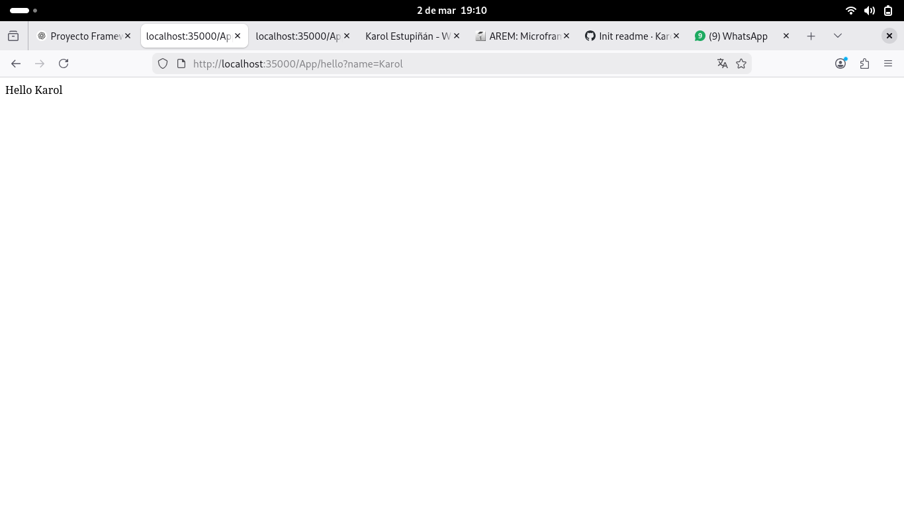
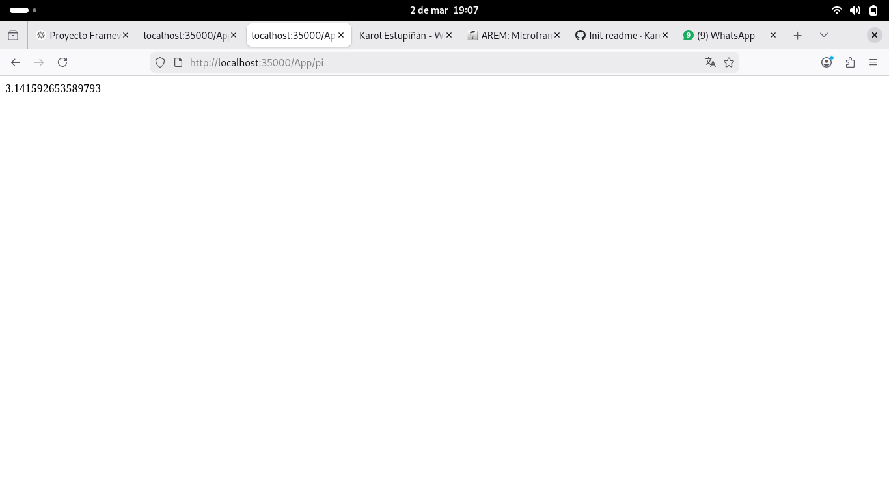
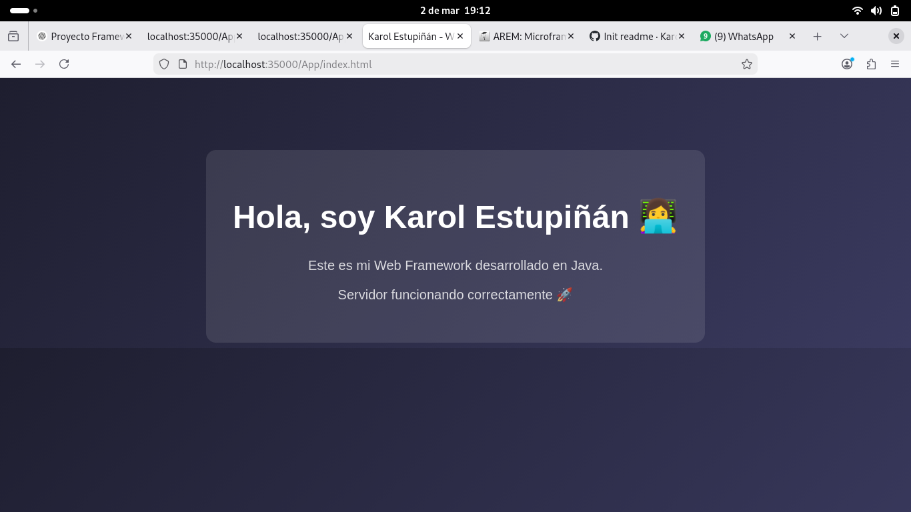

# Web Framework for REST Services and Static File Management


## 📌 Project Overview


This project implements a lightweight web framework built on top of a custom HTTP server in Java. The framework enables developers to:


* Define REST services using lambda expressions.


* Extract query parameters from HTTP requests.


* Serve static files from a configurable directory.


* Handle multiple client requests concurrently.


The framework was developed as part of an academic project to deepen understanding of:


* HTTP protocol architecture


* Internet architecture


* Distributed applications


* Backend service design


---


## 🏗 Architecture


The project follows a modular structure:


### Core Components


* **HttpServer**


Manages socket connections, request handling, endpoint registration, and static file serving.


* **HttpRequest**


Parses and provides access to query parameters.


* **HttpResponse**


Encapsulates response behavior.


* **WebMethod (Functional Interface)**


Allows defining REST services using lambda expressions.


* **MathServices (Example Application)**


Demonstrates how developers can build applications using the framework.


---


## ⚙️ Features


### 1️⃣ REST Services with Lambda Expressions


Developers can register services using:


```
staticfiles("/webroot");
```


```
get("/hello", (req, res) -> "Hello " + req.getValue("name"));
```


```
get("/pi", (req, res) -> String.valueOf(Math.PI));
```


Example request:


```


http://localhost:35000/App/hello?name=Pedro


```


---


### 2️⃣ Query Parameter Extraction


Query parameters are automatically parsed and accessed using:


```
req.getValue("name");
```


---


### 3️⃣ Static File Handling


Static files are served from the configured folder:


```

staticfiles("/webroot");
```


Example:


```


http://localhost:35000/index.html


```


The framework looks for files inside:


```


target/classes/webroot


```


---


### 4️⃣ Application Prefix


REST services are exposed under the `/App` prefix:


```


http://localhost:35000/App/hello


http://localhost:35000/App/pi


```


Static files remain accessible without the prefix.


---


## 🚀 How to Build and Run


### 1️⃣ Clone the Repository


```


git clone <https://github.com/Karol2905/-Microframeworks-WEB>


cd <-Microframeworks-WEB>


```


### 2️⃣ Run the Application


Run:


```


MathServices.java


```


The server runs on:


```


http://localhost:35000


```


---


## 🧪 Tests Performed

### REST Service Test 1

URL:
```
http://localhost:35000/App/hello?name=Karol
```

Expected Output:





---

### REST Service Test 2

URL:
```
http://localhost:35000/App/pi
```

Expected Output:



---

### Static File Test

URL:
```
http://localhost:35000/index.html
```

Expected Output:




## 📂 Project Structure


```


src/


 └── main/
     ├── java/
     │   └── com/example/demo/
     │       ├── HttpServer.java
     │       ├── HttpRequest.java
     │       ├── HttpResponse.java
     │       ├── WebMethod.java
     │       └── appexamples/
     │           └── MathServices.java
     └── resources/
         └── webroot/
             └── index.html


```


---


## 🧠 Technical Concepts Applied


* Socket programming


* HTTP request parsing


* REST service architecture


* Concurrency using threads


* Classpath resource loading


* Functional interfaces and lambda expressions


* Maven project structure


---